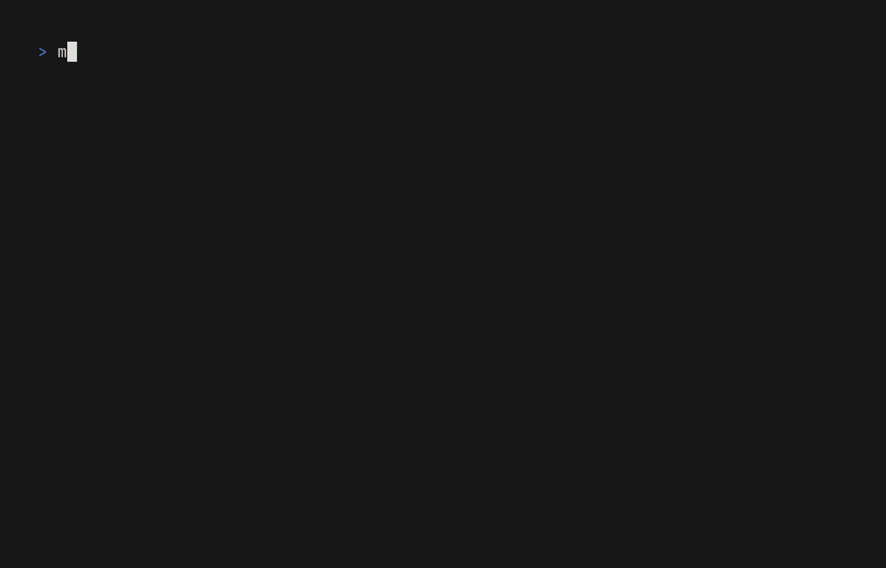
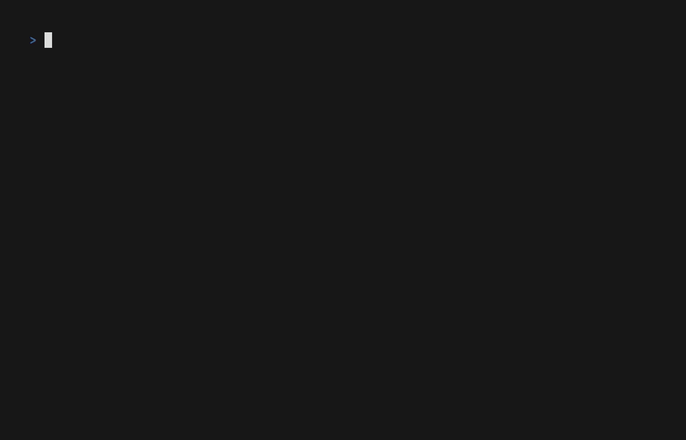

# Wits - The 🥦 Information Tracking System

[](https://app.codacy.com/gh/TheDonDope/wits-tui/dashboard?utm_source=gh&utm_medium=referral&utm_content=&utm_campaign=Badge_grade) [](https://codecov.io/gh/TheDonDope/wits-tui)

Wits aims to help cannabis patients and users to manage and monitor their cannabis consumption and inventory.


## Notable technologies used

Wits is built with the help of the following:

<div align="center">
  <p>
  <a href="https://github.com/charmbracelet/bubbletea">
    
  </a>
  <a href="https://github.com/charmbracelet/bubbles">
    
  </a>
  <a href="https://github.com/charmbracelet/gum">
    
  </a>
  <a href="https://github.com/charmbracelet/huh">
    
  </a>
  <a href="https://github.com/charmbracelet/lipgloss">
    
  </a>
  <a href="https://github.com/charmbracelet/vhs">
    
  </a>
  <a href="https://github.com/spf13/cobra">
    
  </a>
  </p>
</div>

- [charmbracelet/bubbletea](https://github.com/charmbracelet/bubbletea): A powerful little TUI framework 🏗
- [charmbracelet/bubbles](https://github.com/charmbracelet/bubbles): TUI components for Bubble Tea 🫧
- [charmbracelet/gum](https://github.com/charmbracelet/gum): A tool for glamorous shell scripts 🎀
- [charmbracelet/huh](https://github.com/charmbracelet/huh): Build terminal forms and prompts 🤷
- [charmbracelet/lipgloss](https://github.com/charmbracelet/lipgloss): Style definitions for nice terminal layouts 👄
- [charmbracelet/vhs](https://github.com/charmbracelet/vhs): Your CLI home video recorder 📼
- [NimbleMarkets/ntcharts](https://github.com/NimbleMarkets/ntcharts): Nimble Terminal Charts for the Golang BubbleTea framework and your TUIs
- [spf13/cobra](https://github.com/spf13/cobra): A Commander for modern Go CLI interactions

## Changelog & Roadmap

A detailed changelog can be found in the [CHANGELOG.md](./CHANGELOG.md) and the current development progress is tracked in the [ROADMAP.md](./ROADMAP.md). We do not use GitHub Issues but instead track our features, bugfixes and refactorings there.

## Configuring the Application & Required Environment Variables

Wits can be configured through environment variables, detailed here:

| Environment Variable | Description                                                                 |
| -------------------- | --------------------------------------------------------------------------- |
| `LOG_LEVEL`          | The level at which to log (one of: `DEBUG`, `INFO`, `WARN`, `ERROR`, `OFF`) |
| `LOG_DIR`            | The path to the directory for the application logs                          |
| `LOG_FILE`           | The name of the file for the application logs (within `LOG_DIR`)            |
| `WITS_DIR`           | The directory where the application stores its data (defaults to `.wits`)   |
| `STORAGE_MODE`       | The persistance type to use (either `in-memory` or `yml-file`)              |

A minimum viable `.env` file can be found at [.env.example](.env.example). Simply rename it to `.env` to be able to run the application with a yaml file based storage.

## Building & Running the Application

Building the binary and running it requires only a simple invocation to `make`:

```sh
make
```


## Building the Binary for Windows

For windows, the `wits.exe` can be built by invoking the `make build-windows` command:

```sh
make build-windows
```


## Running Tests

- Run the testsuite with coverage enabled:

```sh
make test
```


- Generate the coverage results as html:

```sh
make cover
```



- Open the results in the browser:

```sh
make show-cover
```



Both the `coverage.out` as well as the `coverage.html` are explicitly ignored from source control (see [.gitignore](.gitignore)).
